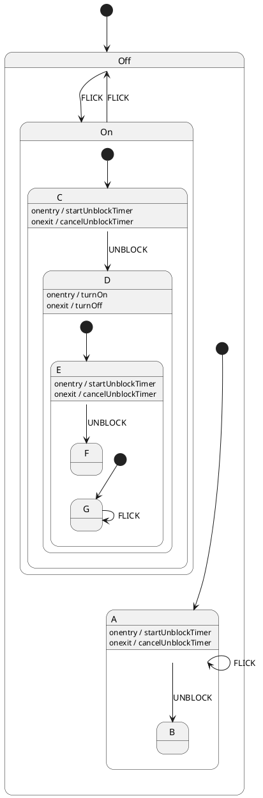

Visualization for xstate using plantuml
=======================================

Given an xstate definition of a statechart, this tool will
output a plantuml source rendering of the statechart.

Installation:

(global install)

    npm -g install

Usage:

    xstate-plantuml <requireablepackage>

or (if not installed globally)

    npm run main <requireablepackage>

The code will "require" the first argument, expecting it to be a full
machine definition, and will print out a plantuml source code that
corresponds to the statechart.

Example invocation:

    xstate-plantuml ./on-off

will load the ./on-off.json file and print out the PlantUML diagram source code

For example, given the following statechart:

```json
{
  "initial": "Off",
  "states": {
    "Off": {
      "on": {
        "FLICK": "On"
      },
      "initial": "A",
      "states": {
        "A": {
          "on": {
            "FLICK": "A",
            "UNBLOCK": "B"
          },
          "onEntry": {
            "type": "startUnblockTimer",
            "delay": 2000
          },
          "onExit": {
            "type": "cancelUnblockTimer"
          }
        },
        "B": {}
      }
    },
    "On": {
      "on": {
        "FLICK": "Off"
      },
      "initial": "C",
      "states": {
        "C": {
          "on": {
            "UNBLOCK": "D"
          },
          "onEntry": {
            "type": "startUnblockTimer",
            "delay": 500
          },
          "onExit": {
            "type": "cancelUnblockTimer"
          }
        },
        "D": {
          "onEntry": {
            "type": "turnOn"
          },
          "onExit": {
            "type": "turnOff"
          },
          "initial": "E",
          "states": {
            "E": {
              "on": {
                "UNBLOCK": "F"
              },
              "onEntry": {
                "type": "startUnblockTimer",
                "delay": 500
              },
              "onExit": {
                "type": "cancelUnblockTimer"
              },
              "initial": "G",
              "states": {
                "G": {
                  "on": {
                    "FLICK": "G"
                  }
                }
              }
            },
            "F": {}
          }
        }
      }
    }
  }
}
```



This results in the following diagram, after running it through PlantUML:

<svg xmlns="http://www.w3.org/2000/svg" xmlns:xlink="http://www.w3.org/1999/xlink" contentScriptType="application/ecmascript" contentStyleType="text/css" height="342px" preserveAspectRatio="none" style="width:1496px;height:342px;" version="1.1" viewBox="0 0 1496 342" width="1496px" zoomAndPan="magnify"><defs><filter height="300%" id="f1mxc37f3hhith" width="300%" x="-1" y="-1"><feGaussianBlur result="blurOut" stdDeviation="2.0"/><feColorMatrix in="blurOut" result="blurOut2" type="matrix" values="0 0 0 0 0 0 0 0 0 0 0 0 0 0 0 0 0 0 .4 0"/><feOffset dx="4.0" dy="4.0" in="blurOut2" result="blurOut3"/><feBlend in="SourceGraphic" in2="blurOut3" mode="normal"/></filter></defs><g><ellipse cx="16" cy="169.5" fill="#000000" filter="url(#f1mxc37f3hhith)" rx="10" ry="10" style="stroke: none; stroke-width: 1.0;"/><rect fill="#FEFECE" filter="url(#f1mxc37f3hhith)" height="163.2969" rx="12.5" ry="12.5" style="stroke: #A80036; stroke-width: 1.5;" width="447" x="87" y="88"/><rect fill="#FFFFFF" height="131" rx="12.5" ry="12.5" style="stroke: #FFFFFF; stroke-width: 1.0;" width="441" x="90" y="117.2969"/><line style="stroke: #A80036; stroke-width: 1.5;" x1="87" x2="534" y1="114.2969" y2="114.2969"/><text fill="#000000" font-family="sans-serif" font-size="14" lengthAdjust="spacingAndGlyphs" textLength="19" x="301" y="105.9951">Off</text><ellipse cx="108" cy="204.2969" fill="#000000" filter="url(#f1mxc37f3hhith)" rx="10" ry="10" style="stroke: none; stroke-width: 1.0;"/><rect fill="#FEFECE" filter="url(#f1mxc37f3hhith)" height="64.2344" rx="12.5" ry="12.5" style="stroke: #A80036; stroke-width: 1.5;" width="195" x="155" y="172.2969"/><line style="stroke: #A80036; stroke-width: 1.5;" x1="155" x2="350" y1="198.5938" y2="198.5938"/><text fill="#000000" font-family="sans-serif" font-size="14" lengthAdjust="spacingAndGlyphs" textLength="9" x="248" y="190.292">A</text><text fill="#000000" font-family="sans-serif" font-size="12" lengthAdjust="spacingAndGlyphs" textLength="174" x="160" y="214.7324">onentry / startUnblockTimer</text><text fill="#000000" font-family="sans-serif" font-size="12" lengthAdjust="spacingAndGlyphs" textLength="175" x="160" y="228.7012">onexit / cancelUnblockTimer</text><rect fill="#FEFECE" filter="url(#f1mxc37f3hhith)" height="50" rx="12.5" ry="12.5" style="stroke: #A80036; stroke-width: 1.5;" width="50" x="451" y="179.2969"/><line style="stroke: #A80036; stroke-width: 1.5;" x1="451" x2="501" y1="205.5938" y2="205.5938"/><text fill="#000000" font-family="sans-serif" font-size="14" lengthAdjust="spacingAndGlyphs" textLength="10" x="471" y="197.292">B</text><!--link *start*Off to A--><path d="M118.3498,204.2969 C125.7293,204.2969 136.8878,204.2969 149.6661,204.2969 " fill="none" id="*start*Off-A" style="stroke: #A80036; stroke-width: 1.0;"/><polygon fill="#A80036" points="154.8354,204.2969,145.8354,200.2969,149.8354,204.2969,145.8354,208.2969,154.8354,204.2969" style="stroke: #A80036; stroke-width: 1.0;"/><!--link A to A--><path d="M230.771,172.0766 C231.21,162.1175 238.453,154.2969 252.5,154.2969 C263.913,154.2969 270.834,159.4597 273.264,166.7376 " fill="none" id="A-A" style="stroke: #A80036; stroke-width: 1.0;"/><polygon fill="#A80036" points="274.229,172.0766,276.565,162.5087,273.3399,167.1563,268.6924,163.9312,274.229,172.0766" style="stroke: #A80036; stroke-width: 1.0;"/><text fill="#000000" font-family="sans-serif" font-size="13" lengthAdjust="spacingAndGlyphs" textLength="34" x="235.5" y="145.3638">FLICK</text><!--link A to B--><path d="M350.009,204.2969 C384.62,204.2969 421.118,204.2969 445.677,204.2969 " fill="none" id="A-B" style="stroke: #A80036; stroke-width: 1.0;"/><polygon fill="#A80036" points="450.732,204.2969,441.732,200.2969,445.732,204.2969,441.732,208.2969,450.732,204.2969" style="stroke: #A80036; stroke-width: 1.0;"/><text fill="#000000" font-family="sans-serif" font-size="13" lengthAdjust="spacingAndGlyphs" textLength="63" x="369" y="200.3638">UNBLOCK</text><rect fill="#FEFECE" filter="url(#f1mxc37f3hhith)" height="323.2969" rx="12.5" ry="12.5" style="stroke: #A80036; stroke-width: 1.5;" width="854" x="630" y="8"/><rect fill="#FFFFFF" height="291" rx="12.5" ry="12.5" style="stroke: #FFFFFF; stroke-width: 1.0;" width="848" x="633" y="37.2969"/><line style="stroke: #A80036; stroke-width: 1.5;" x1="630" x2="1484" y1="34.2969" y2="34.2969"/><text fill="#000000" font-family="sans-serif" font-size="14" lengthAdjust="spacingAndGlyphs" textLength="20" x="1047" y="25.9951">On</text><ellipse cx="651" cy="181.7969" fill="#000000" filter="url(#f1mxc37f3hhith)" rx="10" ry="10" style="stroke: none; stroke-width: 1.0;"/><rect fill="#FEFECE" filter="url(#f1mxc37f3hhith)" height="64.2344" rx="12.5" ry="12.5" style="stroke: #A80036; stroke-width: 1.5;" width="195" x="698" y="149.7969"/><line style="stroke: #A80036; stroke-width: 1.5;" x1="698" x2="893" y1="176.0938" y2="176.0938"/><text fill="#000000" font-family="sans-serif" font-size="14" lengthAdjust="spacingAndGlyphs" textLength="10" x="790.5" y="167.792">C</text><text fill="#000000" font-family="sans-serif" font-size="12" lengthAdjust="spacingAndGlyphs" textLength="174" x="703" y="192.2324">onentry / startUnblockTimer</text><text fill="#000000" font-family="sans-serif" font-size="12" lengthAdjust="spacingAndGlyphs" textLength="175" x="703" y="206.2012">onexit / cancelUnblockTimer</text><rect fill="#FEFECE" filter="url(#f1mxc37f3hhith)" height="269.2344" rx="12.5" ry="12.5" style="stroke: #A80036; stroke-width: 1.5;" width="457" x="994" y="47.2969"/><rect fill="#FFFFFF" height="204" rx="12.5" ry="12.5" style="stroke: #FFFFFF; stroke-width: 1.0;" width="451" x="997" y="109.5313"/><line style="stroke: #A80036; stroke-width: 1.5;" x1="994" x2="1451" y1="106.5313" y2="106.5313"/><line style="stroke: #A80036; stroke-width: 1.5;" x1="994" x2="1451" y1="73.5938" y2="73.5938"/><text fill="#000000" font-family="sans-serif" font-size="14" lengthAdjust="spacingAndGlyphs" textLength="11" x="1217" y="65.292">D</text><text fill="#000000" font-family="sans-serif" font-size="12" lengthAdjust="spacingAndGlyphs" textLength="103" x="999" y="84.7324">onentry / turnOn</text><text fill="#000000" font-family="sans-serif" font-size="12" lengthAdjust="spacingAndGlyphs" textLength="93" x="999" y="98.7012">onexit / turnOff</text><ellipse cx="1015" cy="210.5313" fill="#000000" filter="url(#f1mxc37f3hhith)" rx="10" ry="10" style="stroke: none; stroke-width: 1.0;"/><rect fill="#FEFECE" filter="url(#f1mxc37f3hhith)" height="182.2344" rx="12.5" ry="12.5" style="stroke: #A80036; stroke-width: 1.5;" width="200" x="1062" y="119.5313"/><rect fill="#FFFFFF" height="117" rx="12.5" ry="12.5" style="stroke: #FFFFFF; stroke-width: 1.0;" width="194" x="1065" y="181.7656"/><line style="stroke: #A80036; stroke-width: 1.5;" x1="1062" x2="1262" y1="178.7656" y2="178.7656"/><line style="stroke: #A80036; stroke-width: 1.5;" x1="1062" x2="1262" y1="145.8281" y2="145.8281"/><text fill="#000000" font-family="sans-serif" font-size="14" lengthAdjust="spacingAndGlyphs" textLength="9" x="1157.5" y="137.5264">E</text><text fill="#000000" font-family="sans-serif" font-size="12" lengthAdjust="spacingAndGlyphs" textLength="174" x="1067" y="156.9668">onentry / startUnblockTimer</text><text fill="#000000" font-family="sans-serif" font-size="12" lengthAdjust="spacingAndGlyphs" textLength="175" x="1067" y="170.9355">onexit / cancelUnblockTimer</text><ellipse cx="1083" cy="261.7656" fill="#000000" filter="url(#f1mxc37f3hhith)" rx="10" ry="10" style="stroke: none; stroke-width: 1.0;"/><rect fill="#FEFECE" filter="url(#f1mxc37f3hhith)" height="50" rx="12.5" ry="12.5" style="stroke: #A80036; stroke-width: 1.5;" width="50" x="1130" y="236.7656"/><line style="stroke: #A80036; stroke-width: 1.5;" x1="1130" x2="1180" y1="263.0625" y2="263.0625"/><text fill="#000000" font-family="sans-serif" font-size="14" lengthAdjust="spacingAndGlyphs" textLength="11" x="1149.5" y="254.7607">G</text><!--link *start*E to G--><path d="M1093.1513,261.7656 C1101.1856,261.7656 1113.3258,261.7656 1124.6542,261.7656 " fill="none" id="*start*E-G" style="stroke: #A80036; stroke-width: 1.0;"/><polygon fill="#A80036" points="1129.7844,261.7656,1120.7844,257.7656,1124.7844,261.7656,1120.7844,265.7656,1129.7844,261.7656" style="stroke: #A80036; stroke-width: 1.0;"/><!--link G to G--><path d="M1147.1558,236.59 C1146.8071,226.8561 1149.4219,218.7656 1155,218.7656 C1159.5322,218.7656 1162.1082,224.1066 1162.7278,231.3305 " fill="none" id="G-G" style="stroke: #A80036; stroke-width: 1.0;"/><polygon fill="#A80036" points="1162.8442,236.59,1166.6437,227.5036,1162.7333,231.5913,1158.6456,227.6809,1162.8442,236.59" style="stroke: #A80036; stroke-width: 1.0;"/><text fill="#000000" font-family="sans-serif" font-size="13" lengthAdjust="spacingAndGlyphs" textLength="34" x="1138" y="209.8325">FLICK</text><rect fill="#FEFECE" filter="url(#f1mxc37f3hhith)" height="50" rx="12.5" ry="12.5" style="stroke: #A80036; stroke-width: 1.5;" width="50" x="1363" y="185.5313"/><line style="stroke: #A80036; stroke-width: 1.5;" x1="1363" x2="1413" y1="211.8281" y2="211.8281"/><text fill="#000000" font-family="sans-serif" font-size="14" lengthAdjust="spacingAndGlyphs" textLength="8" x="1384" y="203.5264">F</text><!--link *start*D to E--><path d="M1025.0704,210.5313 C1032.4048,210.5313 1043.6064,210.5313 1056.4966,210.5313 " fill="none" id="*start*D-E" style="stroke: #A80036; stroke-width: 1.0;"/><polygon fill="#A80036" points="1061.7141,210.5313,1052.7141,206.5313,1056.7141,210.5313,1052.7141,214.5313,1061.7141,210.5313" style="stroke: #A80036; stroke-width: 1.0;"/><!--link E to F--><path d="M1262.228,210.5313 C1296.97,210.5313 1333.373,210.5313 1357.83,210.5313 " fill="none" id="E-F" style="stroke: #A80036; stroke-width: 1.0;"/><polygon fill="#A80036" points="1362.863,210.5313,1353.863,206.5313,1357.863,210.5313,1353.863,214.5313,1362.863,210.5313" style="stroke: #A80036; stroke-width: 1.0;"/><text fill="#000000" font-family="sans-serif" font-size="13" lengthAdjust="spacingAndGlyphs" textLength="63" x="1281" y="206.5981">UNBLOCK</text><!--link *start*On to C--><path d="M661.3498,181.7969 C668.7293,181.7969 679.8878,181.7969 692.6661,181.7969 " fill="none" id="*start*On-C" style="stroke: #A80036; stroke-width: 1.0;"/><polygon fill="#A80036" points="697.8354,181.7969,688.8354,177.7969,692.8354,181.7969,688.8354,185.7969,697.8354,181.7969" style="stroke: #A80036; stroke-width: 1.0;"/><!--link C to D--><path d="M893.205,181.7969 C922.036,181.7969 954.961,181.7969 988.575,181.7969 " fill="none" id="C-D" style="stroke: #A80036; stroke-width: 1.0;"/><polygon fill="#A80036" points="993.975,181.7969,984.975,177.7969,988.975,181.7969,984.975,185.7969,993.975,181.7969" style="stroke: #A80036; stroke-width: 1.0;"/><text fill="#000000" font-family="sans-serif" font-size="13" lengthAdjust="spacingAndGlyphs" textLength="63" x="912" y="177.8638">UNBLOCK</text><!--link *start to Off--><path d="M26.0747,169.5 C37.0126,169.5 57.0153,169.5 81.5294,169.5 " fill="none" id="*start-Off" style="stroke: #A80036; stroke-width: 1.0;"/><polygon fill="#A80036" points="86.8273,169.5,77.8273,165.5,81.8273,169.5,77.8273,173.5,86.8273,169.5" style="stroke: #A80036; stroke-width: 1.0;"/><!--link Off to On--><path d="M534.118,169.5 C563.076,169.5 593.483,169.5 624.452,169.5 " fill="none" id="Off-On" style="stroke: #A80036; stroke-width: 1.0;"/><polygon fill="#A80036" points="629.833,169.5,620.833,165.5,624.833,169.5,620.833,173.5,629.833,169.5" style="stroke: #A80036; stroke-width: 1.0;"/><text fill="#000000" font-family="sans-serif" font-size="13" lengthAdjust="spacingAndGlyphs" textLength="34" x="565" y="165.5669">FLICK</text><!--link On to Off--><path d="M629.988,196.415 C607.67,196.177 585.569,195.565 564,194.5 C555.893,194.1 547.645,193.627 539.318,193.096 " fill="none" id="On-Off" style="stroke: #A80036; stroke-width: 1.0;"/><polygon fill="#A80036" points="534.124,192.757,542.8457,197.3322,539.1135,193.0813,543.3645,189.3491,534.124,192.757" style="stroke: #A80036; stroke-width: 1.0;"/><text fill="#000000" font-family="sans-serif" font-size="13" lengthAdjust="spacingAndGlyphs" textLength="34" x="565" y="190.5669">FLICK</text><!--
@startuml
left to right direction


 [*] - -> Off
 state Off {
   [*] - -> A
   Off - -> On: FLICK
   state A {
     A - -> A: FLICK
     A - -> B: UNBLOCK
     A: onentry / startUnblockTimer
     A: onexit / cancelUnblockTimer
   }
   state B {
   }
 }
 state On {
   [*] - -> C
   On - -> Off: FLICK
   state C {
     C - -> D: UNBLOCK
     C: onentry / startUnblockTimer
     C: onexit / cancelUnblockTimer
   }
   state D {
     [*] - -> E
     D: onentry / turnOn
     D: onexit / turnOff
     state E {
       [*] - -> G
       E - -> F: UNBLOCK
       E: onentry / startUnblockTimer
       E: onexit / cancelUnblockTimer
       state G {
         G - -> G: FLICK
       }
     }
     state F {
     }
   }
 }
@enduml

PlantUML version 1.2018.00(Thu Jan 04 19:42:56 UTC 2018)
(GPL source distribution)
Java Runtime: Java(TM) SE Runtime Environment
JVM: Java HotSpot(TM) 64-Bit Server VM
Java Version: 1.7.0_25-b15
Operating System: Linux
Default Encoding: UTF-8
Language: en
Country: US
--></g></svg>

(Thanks to PlantText for the rendering services!)
